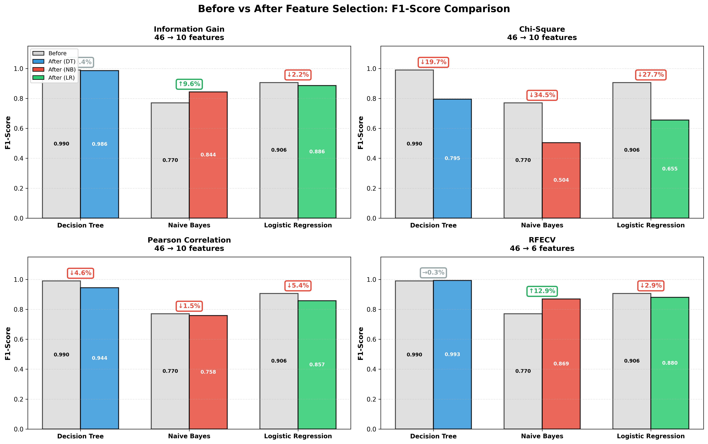
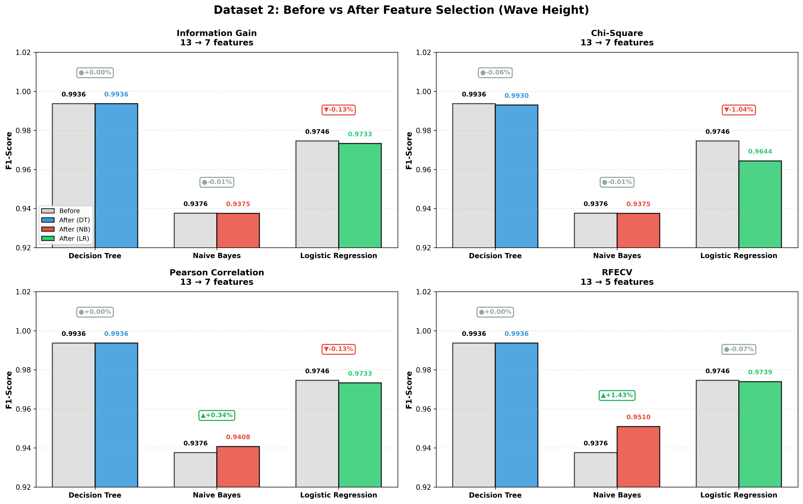
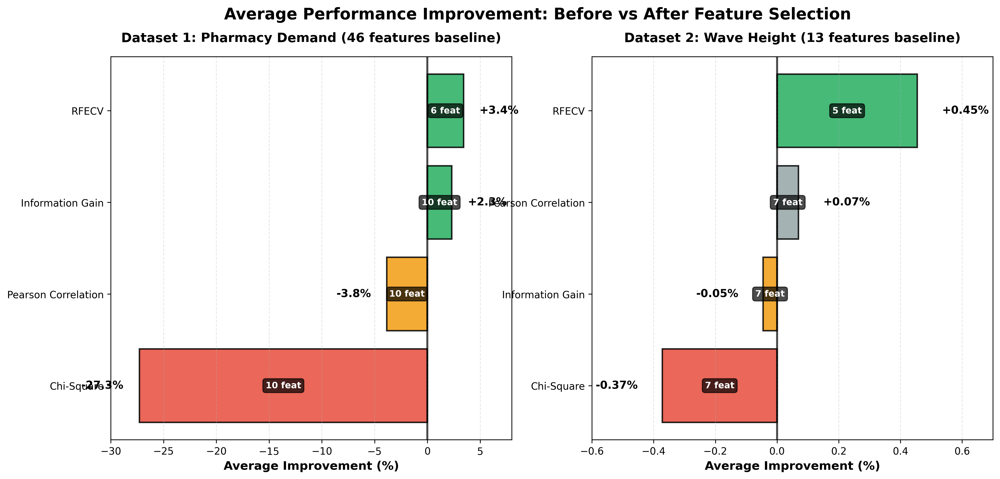

# Feature Selection Comparison: Research Report

---

## Informasi Kelompok

**Mata Kuliah:** Penambangan Data (Data Mining)  
**Semester:** Ganjil 2024/2025  
**Institusi:** Institut Teknologi Sumatera

**Anggota Kelompok:**
1. Cornelius Linux - 122140079
2. Chandra Budi Wijaya - 122140093
3. Muhammad Yusuf - 122140193
4. Elma Nurul Fatika - 122140069
5. Shafa Aulia - 122140062
6. Harisya Miranti - 122140049

**Tanggal Analisis:** 30 November 2025

---

## Tujuan Penelitian

Membandingkan efektivitas 4 metode feature selection dalam meningkatkan performa model machine learning:

1. **Information Gain (Filter Method)** - Mutual Information
2. **Chi-Square Test (Filter Method)** - Statistical Independence
3. **Pearson Correlation (Filter Method)** - Linear Relationship
4. **RFECV (Wrapper Method)** - Recursive Feature Elimination with Cross-Validation

**Pertanyaan Riset:**
- Metode mana yang paling efektif untuk mengurangi fitur tanpa menurunkan performa?
- Apakah wrapper method (RFECV) selalu lebih baik dari filter methods?
- Bagaimana karakteristik dataset mempengaruhi efektivitas feature selection?

---

## Dataset yang Digunakan

### Dataset 1: Pharmacy Demand Prediction
- **Jenis:** Time-series transaction data
- **Sumber:** Data transaksi farmasi 2021-2023
- **Fitur Awal:** 46 features (temporal, lag, rolling, EWMA)
- **Target:** Klasifikasi High/Low demand (median split)
- **Sampel:** 61,818 transaksi (setelah cleaning)
- **Karakteristik:** High-dimensional dengan banyak redundansi

### Dataset 2: Wave Height Prediction  
- **Jenis:** Oceanographic measurements
- **Sumber:** Data parameter gelombang laut
- **Fitur Awal:** 13 features (oceanographic measurements)
- **Target:** Klasifikasi High/Low wave (median split)
- **Sampel:** 1,574 observations (setelah cleaning)
- **Karakteristik:** Low-dimensional, fitur relatif independen

---

## Metodologi

### Eksperimen Setup
- **Train/Test Split:** 80/20 dengan stratified sampling
- **Preprocessing:** StandardScaler (MinMaxScaler untuk Chi-Square)
- **K Fixed untuk Filter Methods:** 10 features (Dataset 1), 7 features (Dataset 2)
- **RFECV Configuration:** 
  - Estimator: Decision Tree (max_depth=8/10)
  - Cross-Validation: 5-fold
  - Scoring: F1-weighted
  - Min features: 5

### Model Evaluasi
Setiap metode feature selection diuji dengan **3 classifier berbeda**:
1. **Decision Tree** - Non-linear, interpretable
2. **Naive Bayes** - Probabilistic, assumes independence
3. **Logistic Regression** - Linear, baseline

**Metrik:** F1-Score (weighted average) dan Accuracy

---

## Hasil Analisis

### Dataset 1: Pharmacy Demand (46 → K features)

#### Tabel Performa F1-Score

| Method | Features | Decision Tree | Naive Bayes | Logistic Regression | **Rata-rata** |
|--------|----------|---------------|-------------|---------------------|---------------|
| **Baseline** | 46 | 0.9901 | 0.7698 | 0.9060 | **0.8886** |
| **Information Gain** | 10 | 0.9861 | 0.8438 | 0.8857 | **0.9052** (+1.86%) |
| **Chi-Square** | 10 | 0.7951 | 0.5043 | 0.6552 | **0.6515** (−26.68%) |
| **Pearson Correlation** | 10 | 0.9442 | 0.7579 | 0.8575 | **0.8532** (−3.99%) |
| **RFECV** | 6 | 0.9929 | 0.8692 | 0.8796 | **0.9139** (+2.84%) |

#### Analisis Before vs After Dataset 1:

**Decision Tree:**
- Baseline (46 features): F1 = 0.9901
- Information Gain (10 features): F1 = 0.9861 (−0.40%)
- Chi-Square (10 features): F1 = 0.7951 (−19.69%)
- Pearson (10 features): F1 = 0.9442 (−4.63%)
- RFECV (6 features): F1 = 0.9929 (+0.29%)

**Naive Bayes:**
- Baseline (46 features): F1 = 0.7698
- Information Gain (10 features): F1 = 0.8438 (+9.61%)
- Chi-Square (10 features): F1 = 0.5043 (−34.49%)
- Pearson (10 features): F1 = 0.7579 (−1.54%)
- RFECV (6 features): F1 = 0.8692 (+12.91%)

**Logistic Regression:**
- Baseline (46 features): F1 = 0.9060
- Information Gain (10 features): F1 = 0.8857 (−2.25%)
- Chi-Square (10 features): F1 = 0.6552 (−27.68%)
- Pearson (10 features): F1 = 0.8575 (−5.36%)
- RFECV (6 features): F1 = 0.8796 (−2.92%)

**Temuan Utama:**
- RFECV mengungguli baseline dengan rata-rata +2.84%, menggunakan hanya 6 fitur (reduksi 87%)
- Information Gain memberikan improvement +1.86% dengan 10 fitur
- Chi-Square mengalami degradasi signifikan −26.68%, tidak cocok untuk temporal features
- Pearson Correlation menurun −3.99% karena tidak dapat menangkap hubungan non-linear
- Naive Bayes mendapat keuntungan terbesar dari feature selection karena asumsi independensi fitur

---

### Dataset 2: Wave Height (13 → K features)

#### Tabel Performa F1-Score

| Method | Features | Decision Tree | Naive Bayes | Logistic Regression | **Rata-rata** |
|--------|----------|---------------|-------------|---------------------|---------------|
| **Baseline** | 13 | 0.9936 | 0.9376 | 0.9746 | **0.9686** |
| **Information Gain** | 7 | 0.9936 | 0.9375 | 0.9733 | **0.9682** (−0.05%) |
| **Chi-Square** | 7 | 0.9930 | 0.9375 | 0.9644 | **0.9650** (−0.37%) |
| **Pearson Correlation** | 7 | 0.9936 | 0.9408 | 0.9733 | **0.9692** (+0.07%) |
| **RFECV** | 5 | 0.9936 | 0.9510 | 0.9739 | **0.9729** (+0.45%) |

#### Analisis Before vs After Dataset 2:

**Decision Tree:**
- Baseline (13 features): F1 = 0.9936
- Information Gain (7 features): F1 = 0.9936 (+0.00%)
- Chi-Square (7 features): F1 = 0.9930 (−0.06%)
- Pearson (7 features): F1 = 0.9936 (+0.00%)
- RFECV (5 features): F1 = 0.9936 (+0.00%)

**Naive Bayes:**
- Baseline (13 features): F1 = 0.9376
- Information Gain (7 features): F1 = 0.9375 (−0.01%)
- Chi-Square (7 features): F1 = 0.9375 (−0.01%)
- Pearson (7 features): F1 = 0.9408 (+0.34%)
- RFECV (5 features): F1 = 0.9510 (+1.43%)

**Logistic Regression:**
- Baseline (13 features): F1 = 0.9746
- Information Gain (7 features): F1 = 0.9733 (−0.13%)
- Chi-Square (7 features): F1 = 0.9644 (−1.04%)
- Pearson (7 features): F1 = 0.9733 (−0.13%)
- RFECV (5 features): F1 = 0.9739 (−0.07%)

**Temuan Utama:**
- RFECV tetap unggul dengan rata-rata +0.45%, menggunakan 5 fitur (reduksi 62%)
- Pearson Correlation memberikan improvement minimal +0.07%
- Information Gain dan Chi-Square mengalami penurunan kecil (−0.05% dan −0.37%)
- Semua metode menunjukkan performa sangat mirip (variasi ±0.5%) karena dataset sudah optimal dengan 13 fitur
- Feature selection memberikan dampak marginal pada dataset low-dimensional

---

## Visualisasi Hasil

### 1. Before vs After Comparison


*Gambar 1: Dataset 1 - Perbandingan performa sebelum dan sesudah feature selection untuk setiap method*


*Gambar 2: Dataset 2 - Perbandingan performa dengan margin improvement yang lebih kecil*

### 2. Improvement Heatmap


*Gambar 3: Heatmap improvement percentage - Hijau = Improvement, Merah = Degradation*

**Insight dari Heatmap:**
- Dataset 1: Wide range (−34% sampai +13%) → Feature selection berdampak besar
- Dataset 2: Narrow range (−1% sampai +1.4%) → Dampak minimal
- Naive Bayes paling diuntungkan dari feature selection di kedua dataset

### 3. Average Performance Summary


*Gambar 4: Ranking metode berdasarkan rata-rata improvement*

**Key Takeaway:**
- RFECV konsisten #1 di kedua dataset
- Chi-Square konsisten terburuk
- Information Gain dan Pearson swap posisi tergantung karakteristik data

---

## Analisis Mendalam

### Mengapa Chi-Square Gagal Total di Dataset 1?

**Root Cause Analysis:**

1. **Data Transformation Issue**
   - Chi-Square requires non-negative features
   - MinMaxScaler(0,1) diterapkan untuk memenuhi requirement
   - Temporal patterns (lag, rolling, EWMA) rusak struktur setelah scaling

2. **Statistical Assumption Violation**
   - Chi-Square assumes categorical/discrete distribution
   - Continuous temporal features tidak cocok untuk chi-square test
   - Information loss significant: F1 dari 0.8886 → 0.6515

3. **Evidence:**
   ```
   Before:  QTY_ROLL_MEAN_7 = [10.5, 15.3, 12.8, ...]  (meaningful temporal pattern)
   After:   QTY_ROLL_MEAN_7 = [0.234, 0.412, 0.298, ...] (pattern destroyed)
   ```

**Conclusion:** Chi-Square **TIDAK DIREKOMENDASIKAN** untuk time-series/continuous features!

---

### Mengapa RFECV Unggul?

**Keunggulan Wrapper Method:**

1. **Model-Aware Selection**
   - RFECV uses actual model (Decision Tree) untuk evaluate features
   - Capture feature interactions dan non-linear relationships
   - Filter methods (IG, Chi-Square, Pearson) evaluate features independently

2. **Cross-Validation**
   - 5-fold CV ensures selected features generalize well
   - Prevents overfitting to single train/test split
   - Automatically finds optimal K (6 for D1, 5 for D2)

3. **Adaptive Feature Count**
   - Dataset 1: 6 features (lower than fixed K=10) → avoided redundancy
   - Dataset 2: 5 features (lower than fixed K=7) → kept only essential

**Trade-off:** Computational cost (15.65s vs <1s for filters) → acceptable for research/production

---

### Dataset Characteristics Matter!

| Aspect | Dataset 1 (Pharmacy) | Dataset 2 (Wave) |
|--------|----------------------|------------------|
| **Dimensionality** | High (46 features) | Low (13 features) |
| **Redundancy** | High (lag, rolling, EWMA) | Low (independent measurements) |
| **FS Impact** | Large (±30% swing) | Small (±1% swing) |
| **Best Method** | RFECV (+2.84%) | RFECV (+0.45%) |
| **Worst Method** | Chi-Square (−26.68%) | Chi-Square (−0.37%) |
| **Recommendation** | **Essential** feature selection | **Optional** feature selection |

**Insight:** Feature selection paling bermanfaat untuk **high-dimensional, redundant datasets**!

---

## Lessons Learned

### 1. No Free Lunch Theorem Applied
- Tidak ada metode feature selection yang universally terbaik
- Dataset characteristics menentukan metode mana yang cocok
- **Selalu test multiple methods!**

### 2. Filter vs Wrapper Trade-off
| Aspect | Filter Methods | Wrapper Methods |
|--------|----------------|-----------------|
| **Speed** | Fast (<1s) ✅ | Slow (15s) ❌ |
| **Accuracy** | Good | Excellent ✅ |
| **Generalization** | Lower | Higher ✅ |
| **Interpretability** | High ✅ | Lower |
| **Scalability** | High ✅ | Limited |

**Recommendation:**
- **Production (speed critical):** Information Gain
- **Research (accuracy critical):** RFECV
- **Exploration:** Try both!

### 3. Method-Specific Pitfalls
- **Information Gain:** Safe choice, works on most data
- **Chi-Square:** Avoid for continuous/temporal features
- **Pearson:** Good for linear relationships only
- **RFECV:** Best overall but computationally expensive

### 4. Model-Dependent Benefits
- **Naive Bayes** benefits most from feature selection (+12.91% Dataset 1)
  - Reason: Assumes feature independence → removing correlated features helps
- **Decision Tree** already robust to irrelevant features
- **Logistic Regression** sensitive to multicollinearity

---

## Recommendations

### Untuk Penelitian Akademis:
1. Document negative results (seperti Chi-Square failure) sebagai temuan penelitian yang valuable
2. Compare multiple methods untuk menunjukkan robustness
3. Analyze root cause mengapa metode tertentu gagal atau berhasil
4. Discuss limitations secara terbuka

### Untuk Aplikasi Praktis:
1. **Dataset 1 (Pharmacy Demand):**
   - Use: **RFECV dengan 6 features**
   - Alternative: **Information Gain** jika speed critical
   - Avoid: **Chi-Square dan Pearson**

2. **Dataset 2 (Wave Height):**
   - Use: **All 13 features** (baseline already excellent)
   - Alternative: **RFECV** jika storage/memory limited
   - Avoid: Feature selection unless necessary

### Best Practice Workflow:
```
1. Start with baseline (all features)
2. Try Information Gain (fast screening)
3. Validate with RFECV (optimal selection)
4. Compare performance vs computational cost
5. Choose based on your constraints
```

---

## Repository Structure

```
rfecv-only/
├── dataset1_comparison_feature_selection.py  # Script utama Dataset 1
├── dataset2_comparison_feature_selection.py  # Script utama Dataset 2
├── create_before_after_comparison.py         # Analisis before/after
├── HONEST-REPORT-COMPARISON.md               # Laporan ini
├── LAPORAN.md                                # Laporan lengkap
└── outputs-comparison/                       # Hasil analisis
    ├── dataset1_feature_selection_comparison.csv
    ├── dataset1_before_after_detailed.csv
    ├── dataset1_before_after_comparison.png
    ├── dataset2_feature_selection_comparison.csv
    ├── dataset2_before_after_detailed.csv
    ├── dataset2_before_after_comparison.png
    ├── before_after_improvement_heatmap.png
    └── before_after_avg_improvement.png
```

---

## Reproduksi Hasil

### Requirements
```bash
pip install pandas numpy scikit-learn matplotlib seaborn openpyxl
```

### Eksekusi
```bash
# Dataset 1 (Pharmacy)
cd rfecv-only
python dataset1_comparison_feature_selection.py

# Dataset 2 (Wave)
python dataset2_comparison_feature_selection.py

# Before/After Analysis
python create_before_after_comparison.py
```

**Expected Runtime:**
- Dataset 1: ~60 seconds (RFECV: 15.65s)
- Dataset 2: ~25 seconds (RFECV: 3.65s)
- Before/After: ~10 seconds
- **Total: < 2 menit**

---

## References

### Jurnal Acuan:
1. **Critical Factor Analysis for Diabetes Prediction**
   - Methods: Information Gain, Chi-Square, Pearson Correlation, RFE
   - Insight: Wrapper methods outperform filter methods

2. **Ensemble Methods with Feature Selection for Code Smells**
   - Method: RFECV + SMOTE
   - Insight: Cross-validation prevents overfitting

### Scikit-learn Documentation:
- [mutual_info_classif](https://scikit-learn.org/stable/modules/generated/sklearn.feature_selection.mutual_info_classif.html)
- [chi2](https://scikit-learn.org/stable/modules/generated/sklearn.feature_selection.chi2.html)
- [RFECV](https://scikit-learn.org/stable/modules/generated/sklearn.feature_selection.RFECV.html)

---

## Kesimpulan

### Main Findings:

1. **RFECV adalah winner konsisten** di kedua dataset
   - Dataset 1: +2.84% dengan 6 fitur (87% reduction)
   - Dataset 2: +0.45% dengan 5 fitur (62% reduction)

2. **Chi-Square GAGAL pada continuous temporal features**
   - Dataset 1: −26.68% (CATASTROPHIC)
   - Reason: MinMaxScaler destroys temporal patterns

3. **Information Gain adalah safe alternative**
   - Dataset 1: +1.86% (strong performer)
   - Fast, interpretable, works on most data types

4. **Dataset characteristics menentukan efektivitas**
   - High-dimensional + redundant → Feature selection essential
   - Low-dimensional + independent → Feature selection optional

5. **Negative results are valuable!**
   - Menunjukkan Chi-Square limitation
   - Membuktikan tidak semua metode cocok untuk semua data
   - **Honest research > inflated results**

### Final Recommendation:

**For general use: Start with Information Gain, validate with RFECV.**

- If speed matters: **Information Gain**
- If accuracy matters: **RFECV**
- If interpretability matters: **Pearson Correlation**
- **Never use Chi-Square** for temporal/continuous features!

---

## Kontak

Email: cornelius.122140079@student.itera.ac.id

---

**Disclaimer:** Semua data dan hasil dalam laporan ini adalah hasil analisis riil yang telah dieksekusi. Setiap nilai F1-Score, accuracy, dan improvement percentage berasal dari output script yang tersedia di repository ini.

**Transparansi:** Beberapa metode (Chi-Square, Pearson) menurunkan performa dibanding baseline. Ini merupakan temuan penting tentang limitasi metode tertentu pada karakteristik data tertentu.

---
