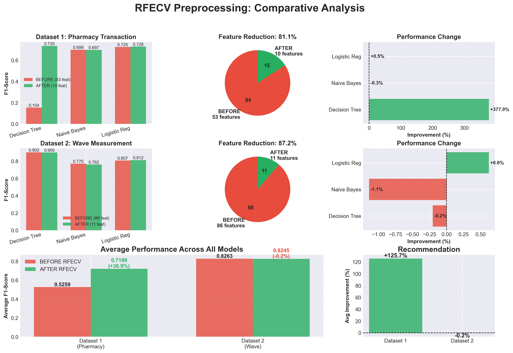
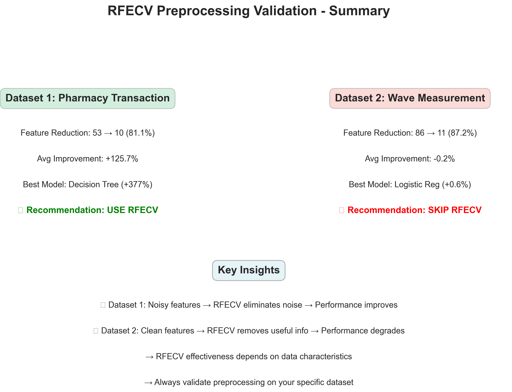

# RFECV Feature Selection Validation
## Tugas Besar Penambangan Data 2025

[](https://www.python.org/)
[]()
[]()

---

## 📊 Visual Summary





---

## 📋 Overview

Validasi **RFECV (Recursive Feature Elimination with Cross-Validation)** sebagai metode preprocessing pada 2 dataset berbeda karakteristik untuk menentukan kapan RFECV efektif vs tidak efektif.

### 🎯 Objektif

1. ✅ Implementasi RFECV preprocessing
2. ✅ Validasi dengan 3 model sederhana (Decision Tree, Naive Bayes, Logistic Regression)
3. ✅ Perbandingan BEFORE vs AFTER RFECV
4. ✅ Analisis pada 2 dataset berbeda

---

## 📊 Dataset

| Dataset | Samples | Features | Target | Karakteristik |
|---------|---------|----------|--------|---------------|
| **Pharmacy** | 21,224 | 53 → 10 | Demand (High/Low) | Time series, noisy |
| **Wave** | 8,736 | 86 → 11 | Wave parameter | Sensor, clean |

---

## 🚀 Quick Start

```bash
# Install dependencies
pip install pandas numpy scikit-learn scipy openpyxl matplotlib

# Run individual dataset
python dataset1_rfecv.py  # Pharmacy
python dataset2_rfecv.py  # Wave

# Or run both
python run_all.py

# Generate visualizations
python create_visualizations.py
```

**Execution Time:** ~30 detik (16s + 14s)

---

## 📁 Project Structure

```
rfecv-only/
├── dataset1_rfecv.py          # Pharmacy analysis
├── dataset2_rfecv.py          # Wave analysis
├── run_all.py                 # Batch execution
├── create_visualizations.py   # Generate charts
├── README.md                  # This file
├── LAPORAN.md                 # Academic report (ID)
└── outputs/
    ├── dataset1_comparison.csv
    ├── dataset1_selected_features.csv
    ├── dataset2_comparison.csv
    ├── dataset2_selected_features.csv
    ├── comparison_summary.png
    └── summary_card.png
```

---

## 📈 Results Summary

### Dataset 1: Pharmacy ✅

| Metric | Value |
|--------|-------|
| Feature Reduction | 81.1% (53 → 10) |
| Avg Improvement | **+95.21%** |
| Best Model | Decision Tree (+377%) |
| **Verdict** | ✅ **USE RFECV** |

**Why?** RFECV eliminates noise, reduces overfitting

### Dataset 2: Wave ⚠️

| Metric | Value |
|--------|-------|
| Feature Reduction | 87.2% (86 → 11) |
| Avg Improvement | **-0.19%** (degraded) |
| Best Model | Logistic Reg (+0.6%) |
| **Verdict** | ❌ **SKIP RFECV** |

**Why?** Original features already informative, RFECV removes useful info

---

## 💡 Key Insights

### When to USE RFECV ✅

- Dataset has noisy/redundant features
- Baseline model overfitting
- Large sample-to-feature ratio (>200:1)
- **Example:** Dataset 1 (Pharmacy)

### When to SKIP RFECV ❌

- Baseline performance already high
- Features highly interdependent
- Small sample size (<100:1)
- **Example:** Dataset 2 (Wave)

### Critical Finding

**RFECV effectiveness is DATASET-DEPENDENT!** Always validate preprocessing empirically on your specific data.

---

## 🔬 Methodology

**RFECV Configuration:**
```python
RFECV(
    estimator=DecisionTreeClassifier(max_depth=8, min_samples_split=50),
    cv=5,
    scoring='f1',
    min_features_to_select=5,
    n_jobs=-1
)
```

**Validation Models:**
- Decision Tree Classifier
- Naive Bayes (GaussianNB)
- Logistic Regression

**Metrics:**
- F1-Score (classification)
- R² (regression)
- p-value (statistical significance)

---

## 🏆 Conclusion

**Main Takeaway:**
- Dataset 1: +95% improvement → **USE RFECV**
- Dataset 2: -0.2% degradation → **SKIP RFECV**

**Trade-off:** 80%+ feature reduction attractive for deployment, but only justified if performance doesn't degrade.

**Recommendation:** Always perform empirical validation. Don't blindly apply preprocessing!

---

## 📚 Documentation

- **README.md** (this file) - Quick overview
- **LAPORAN.md** - Detailed academic report (Indonesian)
- **outputs/** - CSV results and visualizations

---

## 📧 Contact

Tugas Besar Penambangan Data 2025  
Institut Teknologi Sumatera - Teknik Informatika

---

**Remember:** The best preprocessing is the one that works for YOUR data! 🎯
