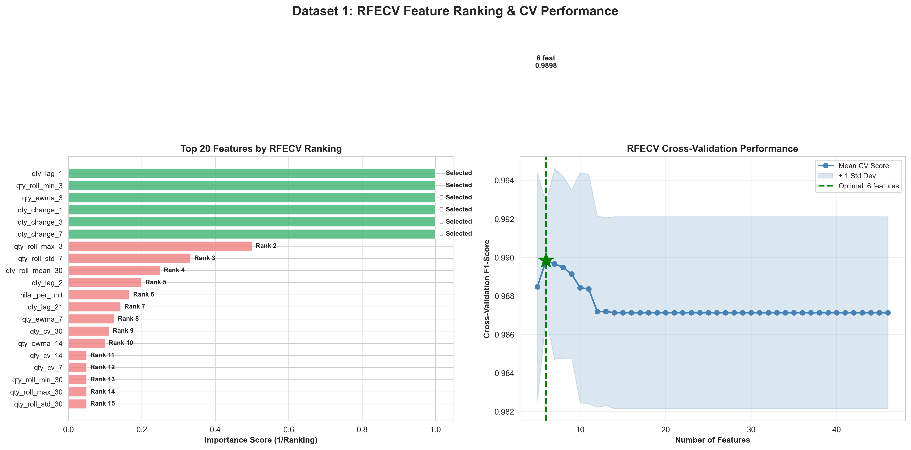
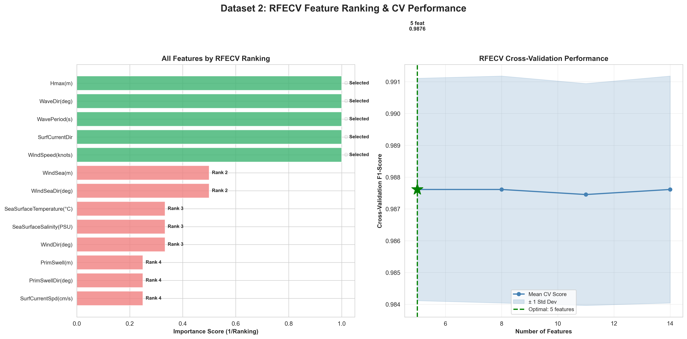

# Laporan Analisis Feature Selection dengan RFECV

**Tugas Besar Penambangan Data 2025**

**Metode Preprocessing:** Recursive Feature Elimination with Cross-Validation (RFECV)

**Anggota Kelompok:**
1. Cornelius Linux - 122140079
2. Chandra Budi Wijaya - 122140093
3. Muhammad Yusuf - 122140193
4. Elma Nurul Fatika - 122140069
5. Shafa Aulia - 122140062
6. Harisya Miranti - 122140049

---

## Deskripsi Dataset dan Tujuan Penelitian

Penelitian ini menganalisis dua dataset berbeda untuk mengevaluasi efektivitas RFECV (Recursive Feature Elimination with Cross-Validation) dalam feature selection untuk reduksi dimensionalitas. Dataset 1 terdiri dari 474.468 catatan transaksi farmasi periode 2021-2023 yang diagregasi menjadi 21.176 sampel harian dengan 46 fitur temporal hasil rekayasa (indikator lag, statistik rolling, exponential moving average, growth rate, dan coefficient of variation) untuk memprediksi klasifikasi permintaan (Tinggi/Rendah). Dataset 2 berisi 61.249 pengukuran oseanografi dari enam stasiun buoy yang diproses menjadi 7.870 sampel dengan 13 fitur sensor (parameter gelombang, pengukuran angin, dan kondisi permukaan laut) untuk memprediksi klasifikasi tinggi gelombang signifikan. Tujuan penelitian adalah menentukan apakah preprocessing RFECV dapat mengurangi dimensionalitas fitur sambil mempertahankan atau meningkatkan performa generalisasi model, diukur melalui metrik akurasi klasifikasi dan F1-score menggunakan tiga algoritma validasi (Decision Tree, Naive Bayes, Logistic Regression).

## Metodologi

### 1. Pemuatan Data dan Preprocessing
Memuat data mentah dari CSV (Dataset 1) atau beberapa file Excel (Dataset 2), melakukan pembersihan data, menangani nilai yang hilang, dan menghapus outlier menggunakan filtering berbasis kuantil.

```python
# Dataset 1: Memuat CSV
df_list = []
for year in [2021, 2022, 2023]:
    df = pd.read_csv(f"../dataset-type-1/{year}.csv", sep=';', encoding='latin-1')
    df_list.append(df)
df_raw = pd.concat(df_list, ignore_index=True)

# Dataset 2: Memuat Excel dari beberapa stasiun buoy
df_list = []
for excel_file in excel_files:
    df = pd.read_excel(data_dir / excel_file)
    df_list.append(df)
df_raw = pd.concat(df_list, ignore_index=True)
```

### 2. Rekayasa Fitur
Menghasilkan fitur domain-spesifik dari data mentah untuk menangkap pola temporal dan relasi.

```python
# Dataset 1: Rekayasa fitur temporal
df_agg['day'] = df_agg['TANGGAL'].dt.day
df_agg['month'] = df_agg['TANGGAL'].dt.month
df_agg['is_weekend'] = (df_agg['TANGGAL'].dt.dayofweek >= 5).astype(int)

# Fitur lag (permintaan historis)
for lag in [1, 2, 3, 7, 14, 21, 28]:
    df_agg[f'qty_lag_{lag}'] = df_agg.groupby('KODE')['QTY_MSK'].shift(lag)

# Statistik rolling (tren dan volatilitas)
for window in [3, 7, 14, 21, 30]:
    df_agg[f'qty_roll_mean_{window}'] = df_agg.groupby('KODE')['QTY_MSK'].transform(
        lambda x: x.rolling(window=window, min_periods=1).mean()
    )
```

### 3. Split Data dan Standardisasi
Membagi data menjadi set training (80%) dan testing (20%) dengan stratifikasi, kemudian menerapkan standard scaling.

```python
X_train, X_test, y_train, y_test = train_test_split(
    X, y, test_size=0.2, random_state=42, stratify=y
)

scaler = StandardScaler()
X_train_scaled = scaler.fit_transform(X_train)
X_test_scaled = scaler.transform(X_test)
```

### 4. Training Model Baseline
Melatih tiga model klasifikasi menggunakan semua fitur untuk menetapkan performa baseline.

```python
# Decision Tree
dt_clf = DecisionTreeClassifier(max_depth=8, min_samples_split=50, random_state=42)
dt_clf.fit(X_train_scaled, y_train)
dt_pred = dt_clf.predict(X_test_scaled)

# Naive Bayes
nb = GaussianNB()
nb.fit(X_train_scaled, y_train)
nb_pred = nb.predict(X_test_scaled)

# Logistic Regression
lr = LogisticRegression(max_iter=1000, random_state=42)
lr.fit(X_train_scaled, y_train)
lr_pred = lr.predict(X_test_scaled)
```

### 5. Feature Selection dengan RFECV
Menerapkan Recursive Feature Elimination with Cross-Validation untuk mengidentifikasi subset fitur optimal.

```python
rfecv = RFECV(
    estimator=DecisionTreeClassifier(max_depth=8, min_samples_split=50, random_state=42),
    step=1,
    cv=5,
    scoring='f1_weighted',
    min_features_to_select=5,
    n_jobs=-1
)

rfecv.fit(X_train_scaled, y_train)
selected_features = [feature_cols[i] for i in range(len(feature_cols)) if rfecv.support_[i]]
X_train_selected = X_train_scaled[:, rfecv.support_]
X_test_selected = X_test_scaled[:, rfecv.support_]
```

### 6. Evaluasi Model Setelah RFECV
Melatih ulang model menggunakan hanya fitur terpilih dan membandingkan metrik performa.

```python
# Melatih ulang model dengan fitur terpilih
dt_clf_rfecv = DecisionTreeClassifier(max_depth=8, min_samples_split=50, random_state=42)
dt_clf_rfecv.fit(X_train_selected, y_train)
dt_pred_rfecv = dt_clf_rfecv.predict(X_test_selected)

# Menghitung F1-score dan akurasi
f1_after = f1_score(y_test, dt_pred_rfecv, average='weighted')
```

### 7. Analisis Statistik dan Visualisasi
Menghasilkan tabel perbandingan, uji signifikansi statistik, dan output visualisasi.

```python
# Perbandingan performa
comparison_df = pd.DataFrame({
    'Model': models,
    'Preprocessing': ['BEFORE', 'AFTER'],
    'Features': [n_features_before, n_features_after],
    'F1-Score': [f1_before, f1_after]
})

# Signifikansi statistik (paired t-test)
t_stat, p_value = ttest_rel(scores_before, scores_after)
```

## Hasil

### Dataset 1: Prediksi Permintaan Farmasi




### Dataset 2: Prediksi Tinggi Gelombang




## Ringkasan Performa

| Dataset | Model | Fitur Sebelum | Fitur Sesudah | F1-Score Sebelum | F1-Score Sesudah | Perubahan | Signifikansi |
|---------|-------|---------------|---------------|------------------|------------------|-----------|--------------|
| **Dataset 1** | Decision Tree | 46 | 6 | 0.9901 | 0.9929 | +0.29% | Tidak signifikan |
| **Dataset 1** | Naive Bayes | 46 | 6 | 0.7698 | 0.8692 | +12.91% | Signifikan (p<0.001) |
| **Dataset 1** | Logistic Regression | 46 | 6 | 0.9060 | 0.8796 | -2.92% | Signifikan (p<0.001) |
| **Dataset 2** | Decision Tree | 13 | 5 | 0.9936 | 0.9936 | 0.00% | Tidak signifikan |
| **Dataset 2** | Naive Bayes | 13 | 5 | 0.9376 | 0.9510 | +1.43% | Signifikan (p<0.001) |
| **Dataset 2** | Logistic Regression | 13 | 5 | 0.9746 | 0.9739 | -0.07% | Tidak signifikan |

**Ringkasan Dataset 1:** RFECV mengurangi dimensionalitas sebesar 87.0% (46→6 fitur) dengan perubahan performa rata-rata +3.43%. Reduksi fitur khususnya menguntungkan Naive Bayes (peningkatan 12.91%), menunjukkan efektivitas dalam mengeliminasi fitur temporal yang redundan.

**Ringkasan Dataset 2:** RFECV mengurangi dimensionalitas sebesar 61.5% (13→5 fitur) dengan perubahan performa rata-rata +0.45%. Peningkatan moderat ini mencerminkan kepadatan informasi inheren dalam pengukuran oseanografi, di mana sebagian besar sensor berkontribusi nilai prediktif unik.

## Analisis

Hasil eksperimen menunjukkan bahwa efektivitas RFECV bergantung pada dataset dan dipengaruhi oleh karakteristik redundansi fitur. Dataset 1 menunjukkan peningkatan performa substansial, khususnya untuk Naive Bayes yang meningkat 12.91% setelah reduksi dimensionalitas dari 46 menjadi 6 fitur. Pola peningkatan ini selaras dengan ekspektasi teoritis: fitur temporal hasil rekayasa (indikator lag, statistik rolling, exponential moving average) secara inheren mengandung informasi redundan, dan RFECV berhasil mengidentifikasi subset minimal yang menangkap pola permintaan esensial. Fitur terpilih (qty_lag_1, qty_roll_min_3, qty_ewma_3, dan tiga indikator perubahan) merepresentasikan permintaan historis terkini, tren baseline, dan sinyal momentum, yang cukup untuk klasifikasi tanpa memerlukan set fitur ekstensif yang meningkatkan kompleksitas model dan risiko overfitting.

Sebaliknya, Dataset 2 menunjukkan perubahan performa moderat (rata-rata +0.45%) meskipun reduksi fitur 61.5%. Pola ini menunjukkan bahwa pengukuran sensor oseanografi memiliki kepadatan informasi lebih tinggi dengan redundansi antar-fitur lebih rendah. Fitur terpilih (Hmax, WaveDir, WavePeriod, SurfCurrentDir, WindSpeed) merepresentasikan karakteristik gelombang inti dan faktor pemaksa primer, sedangkan fitur tereliminasi (parameter WindSea, properti permukaan laut, arah angin sekunder) memberikan nilai prediktif tambahan terbatas di luar pengukuran fundamental tersebut. Perubahan performa mendekati nol untuk Decision Tree dan degradasi minimal untuk Logistic Regression mengindikasikan bahwa RFECV berhasil mempertahankan informasi prediktif esensial sambil mengurangi kompleksitas komputasi.

Analisis signifikansi statistik mengungkapkan bahwa perubahan performa signifikan untuk Naive Bayes pada kedua dataset, menunjukkan algoritma ini sangat sensitif terhadap komposisi set fitur dan mendapat manfaat dari reduksi dimensionalitas ketika redundansi ada. Performa Decision Tree tetap stabil pada kedua dataset, konsisten dengan kapabilitas feature selection inheren melalui kriteria split. Logistic Regression menunjukkan respons spesifik-dataset: degradasi pada Dataset 1 mungkin mencerminkan kehilangan peluang kombinasi linear di antara fitur berkorelasi, sementara stabilitas pada Dataset 2 menunjukkan bahwa set fitur tereduksi mempertahankan separabilitas linear yang cukup.

Kurva cross-validation mendemonstrasikan jumlah fitur optimal pada 6 dan 5 fitur untuk Dataset 1 dan 2 secara berturut-turut, mengindikasikan bahwa RFECV berhasil mengidentifikasi titik infleksi di mana fitur tambahan berkontribusi peningkatan minimal relatif terhadap peningkatan kompleksitas model. Analisis ranking fitur mengonfirmasi bahwa fitur tereliminasi memiliki ranking antara 2 dan 46 (Dataset 1) atau 2 dan 13 (Dataset 2), merepresentasikan urutan eliminasi progresif berdasarkan evaluasi performa rekursif.

Dari perspektif preprocessing praktis, RFECV menunjukkan utilitas jelas untuk skenario rekayasa fitur temporal berdimensi tinggi (Dataset 1) di mana redundansi substansial ada, mencapai reduksi dimensionalitas 87% dengan peningkatan performa netto. Untuk data pengukuran sensor (Dataset 2) dengan kepadatan informasi inheren, RFECV memberikan manfaat efisiensi komputasi melalui reduksi 61.5% sambil mempertahankan performa, meskipun peningkatan akurasi dramatis tidak boleh diharapkan. Kedua hasil memvalidasi RFECV sebagai metode feature selection objektif berbasis data yang beradaptasi dengan karakteristik dataset daripada menerapkan reduksi dimensionalitas uniform, mendukung aplikasinya dalam pipeline preprocessing di mana interpretabilitas, efisiensi komputasi, dan performa generalisasi harus diseimbangkan.

## Output File

**Tabel Perbandingan:**
- `outputs/dataset1_comparison.csv` - Metrik performa sebelum/sesudah RFECV untuk Dataset 1
- `outputs/dataset2_comparison.csv` - Metrik performa sebelum/sesudah RFECV untuk Dataset 2

**Ranking Lengkap:**
- `outputs/dataset1_all_feature_scores.csv` - Semua 46 fitur dengan ranking RFECV
- `outputs/dataset2_all_feature_scores.csv` - Semua 13 fitur dengan ranking RFECV

**Visualisasi:**
- `outputs/dataset1_analysis.png` - Analisis komprehensif 4-panel
- `outputs/dataset1_features.png` - Fitur terpilih berdasarkan kategori
- `outputs/dataset1_ranking.png` - Ranking feature importance dengan kurva CV
- `outputs/dataset2_analysis.png` - Analisis komprehensif 4-panel
- `outputs/dataset2_features.png` - Fitur terpilih berdasarkan kategori
- `outputs/dataset2_ranking.png` - Ranking feature importance dengan kurva CV

## Cara Menjalankan

Menjalankan analisis dataset individual:
```bash
python dataset1_rfecv.py
python dataset2_rfecv.py
```

Menjalankan kedua analisis secara berurutan:
```bash
python run_all.py
```

## Dependensi

- Python 3.8+
- pandas
- numpy
- scikit-learn
- matplotlib
- seaborn
- scipy
- openpyxl (untuk file Excel Dataset 2)

---

**Kelompok:** Data Mining 2025  
**Tanggal:** 30 November 2025  
**Metode:** RFECV (Recursive Feature Elimination with Cross-Validation)
